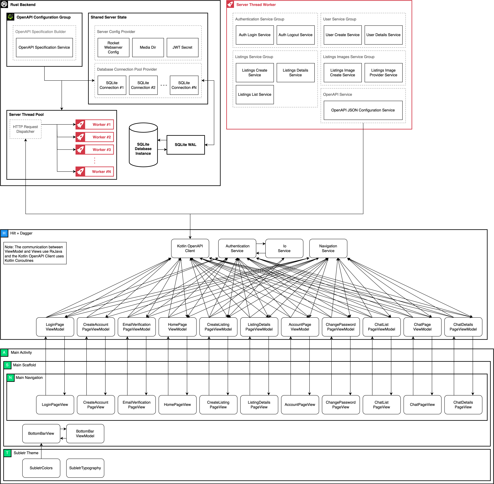

[![Contributors][contributors-shield]][contributors-url]
[![Forks][forks-shield]][forks-url]
[![Stars][stars-shield]][stars-url]
[![Issues][issues-shield]][issues-url]

 

    
    <h1 align="center">Subletr</h3>

> An android app built for university students to sublet directly to other university students

 

## Table of Contents

- [Architecture](#architechture)
- [Building](#building)
- [Contributors](#contributors)

## Architechture

 

## Building

To build the android app, you must have android studio installed with at least JDK 17. Simply, open the android subdirectory in android studio and run.

To build the backend, you must have [rust 1.66.0+][rust-install] installed. There are two scripts to build and run the server in the scripts directory for testing and production deployment, named `server_run` and `server_run_production` respectively.

## Contributors

<table>
<tbody>
<tr>
    <td align="center" valign="top" width="15%">
        <a href="https://github.com/AhbedShawarma">
            
             
            <b>Abhay Sharma</b>
        </a>
    </td>
    <td align="center" valign="top" width="15%">
        <a href="https://github.com/andr-dev">
            
             
            <b>Andre Benedito</b>
        </a>
    </td>
    <td align="center" valign="top" width="15%">
        <a href="https://github.com/pxlin-09">
            
             
            <b>Alex Lin</b>
        </a>
    </td>
    <td align="center" valign="top" width="15%">
        <a href="https://github.com/henryhu1">
            
             
            <b>Henry Hu</b>
        </a>
    </td>
    <td align="center" valign="top" width="15%">
        <a href="https://github.com/Jiay0928">
            
             
            <b>Jiaying Cui</b>
        </a>
    </td>
    <td align="center" valign="top" width="15%">
        <a href="https://github.com/leeminkyu16">
            
             
            <b>Min-Kyu Lee</b>
        </a>
    </td>
</tr>
</tbody>
</table>

[contributors-shield]: https://img.shields.io/github/contributors/andr-dev/CS446.svg?style=flat-square
[contributors-url]: https://github.com/andr-dev/CS446/graphs/contributors
[forks-shield]: https://img.shields.io/github/forks/andr-dev/CS446.svg?style=flat-square
[forks-url]: https://github.com/andr-dev/CS446/network/members
[stars-shield]: https://img.shields.io/github/stars/andr-dev/CS446.svg?style=flat-square
[stars-url]: https://github.com/andr-dev/CS446/stargazers
[issues-shield]: https://img.shields.io/github/issues/andr-dev/CS446.svg?style=flat-square
[issues-url]: https://github.com/andr-dev/CS446/issues
[rust-install]: https://www.rust-lang.org/tools/install
